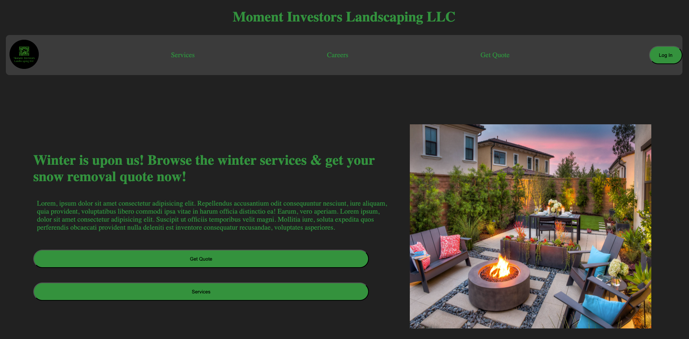

# Landscaping Web App 
A user friendly web applicaiton designed to streamline landscaping service requests, project management, and client communication.

# Overview
This application is the base for my landscaping businesse to manage appointments, showcase services, track projects, and allow customers to request quotes online.

# Features
* Home page
* Service page - displays current services
* Quote request form
* Login form
* User landing page

# Tech Stack
* React
* Express.js/Node.js
* MongoDB
* Render/Netlify

# Site URL
https://capstoneproject-landscaping-frontend.netlify.app/

# Screenshots

# Contact
If any questions, concerns, suggestions, or new ideas, please fell free to contact me through email.
* Developer: Sean Moman
* Email: moman7_s@yahoo.com

